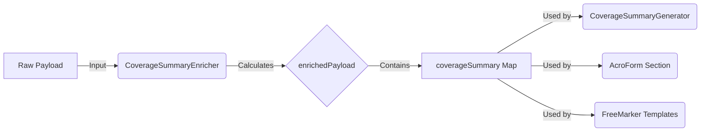

Read , lines 1 to 100

Read , lines 40 to 100

The `CoverageSummaryEnricher` and `CoverageSummaryGenerator` work together as a **Producer-Consumer** pair to separate business logic from presentation logic.

### 1. The Producer: `CoverageSummaryEnricher`
This class is responsible for **preparing the data**. It takes the raw, complex payload and simplifies it into a structure that is easy to display.

*   **Calculates Totals**: It iterates through all members and their products to sum up the `totalPremium`.
*   **Calculates Ages**: It takes `dateOfBirth` and calculates the current age (e.g., "40").
*   **Standardizes Data**: It handles different payload structures (e.g., `members` vs `applicants`) and creates a unified list called `enrichedApplicants`.
*   **Output**: It places all this prepared data into a new map key: `payload.get("coverageSummary")`.

### 2. The Consumer: `CoverageSummaryGenerator`
This class is responsible for **displaying the data**. It doesn't do any complex math or logic; it just reads the prepared values and draws them on the PDF.

*   **Reads Prepared Data**: It looks specifically for the `coverageSummary` key that the enricher created.
*   **Draws Text**: It takes values like `totalPremium` and `calculatedAge` directly from the map and draws them using PDFBox commands (`contentStream.showText(...)`).
*   **Iterates List**: It loops through the `enrichedApplicants` list (prepared by the enricher) to draw each person's details.

### Why split them?
*   **Simpler Generator**: The PDF drawing code is already complex (coordinates, fonts, margins). By moving the math to the enricher, the generator code stays clean and focused on layout.
*   **Reusability**: The enriched data (like `totalPremium`) is also available to other sections! For example, your `enrollment-form` (AcroForm) also uses `coverageSummary.totalPremium` to fill a form field.
*   **Consistency**: Since both the PDF page and the AcroForm use the same calculated value from the enricher, you are guaranteed they will match.

### Data Flow Diagram
